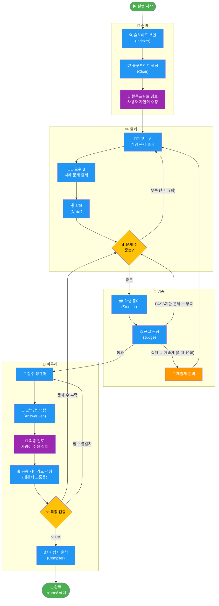
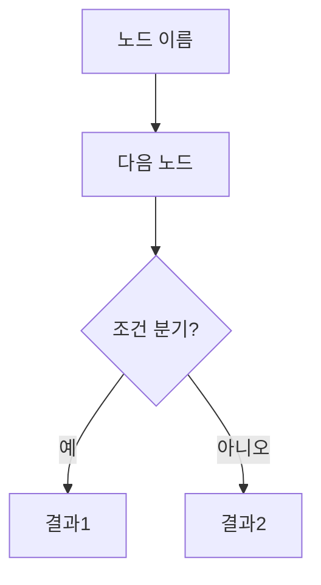

# 시험 문제 자동 생성 시스템

강의 슬라이드 PDF를 입력하면 AI 에이전트들이 협력해 시험 문제·모범답안·루브릭을 자동 생성합니다.

---

## 에이전트 파이프라인



**색상 범례**
- 🔵 파란색 — AI 에이전트 자동 처리
- 🟣 보라색 — 사람이 직접 개입하는 단계
- 🟡 노란색 — 조건 분기 (결과에 따라 흐름이 달라짐)
- 🟢 초록색 — 시작 / 완료

---

## 실행 방법

```bash
# 인터랙티브 모드 (권장)
python main.py

# CLI 모드
python main.py --pdf lecture --total 100 --questions 8
```

lecture/ 폴더에 PDF를 넣고 실행하면 됩니다.

---

## 출력

`exams/` 폴더에 두 파일이 생성됩니다.

| 파일 | 내용 |
|------|------|
| `exam_MMDD_HHMM.docx` | 시험지 (문제 + 배점) |
| `answer_key_MMDD_HHMM.docx` | 모범답안 + 루브릭 |

---

## Mermaid 다이어그램 수정하는 법

위 파이프라인 그림은 **Mermaid** 문법으로 작성되어 있습니다.
GitHub에서 자동으로 렌더링되며, 텍스트로 관리합니다.

### 기본 문법

````markdown

````

### 노드 모양

```
[텍스트]      → 사각형
(텍스트)      → 둥근 사각형
{텍스트}      → 마름모 (조건)
([텍스트])    → 경기장 모양 (시작/끝)
```

### 방향

```
TD  위→아래   LR  왼쪽→오른쪽
BT  아래→위   RL  오른쪽→왼쪽
```

### 색상

```
style 노드이름 fill:#색상코드,color:#글자색
```

### 브라우저에서 바로 테스트

https://mermaid.live 에 코드를 붙여넣으면 실시간으로 확인할 수 있습니다.
