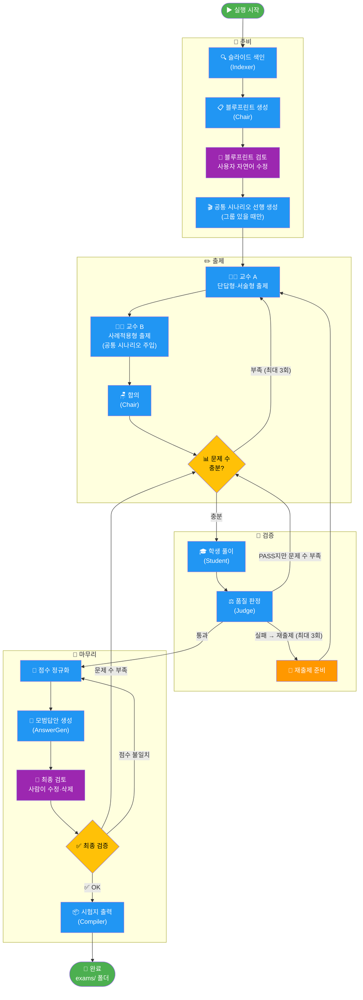
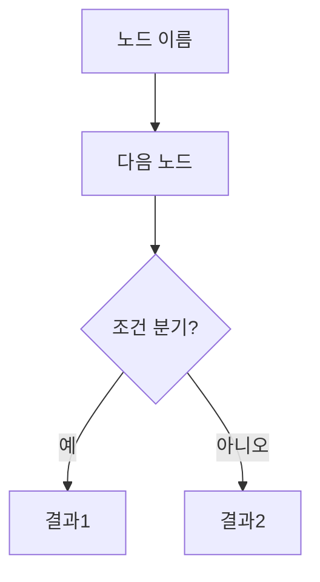

# 시험 문제 자동 생성 시스템

강의 슬라이드 PDF를 입력하면 AI 에이전트들이 협력해 시험 문제·모범답안·루브릭을 자동 생성합니다.

---

## 에이전트 파이프라인



**색상 범례**
- 🔵 파란색 — AI 에이전트 자동 처리
- 🟣 보라색 — 사람이 직접 개입하는 단계
- 🟡 노란색 — 조건 분기 (결과에 따라 흐름이 달라짐)
- 🟢 초록색 — 시작 / 완료

---

## 대문제 그룹화 규칙

실행 시 인터랙티브 마법사에서 사례출제형 그룹 패턴을 숫자로 입력합니다.

```
사례출제형 문제 수: 4
그룹 구성 입력 (합계 4): 2,2
```

- `2,2` → 2문제씩 두 그룹 (공통 시나리오 2개)
- `4` → 전체 한 그룹 (공통 시나리오 1개)
- Enter → 모두 독립 문제

블루프린트 생성 후에는 어떤 단원들을 묶을지 단원 번호로 재배정할 수 있습니다.

### ✅ 올바른 그룹화 — 사례적용형끼리만

```
대문제 1.
  다음 사례를 읽고 아래 물음에 답하시오.
  [A기업은 PCB 불량률 문제를 겪고 있으며...]

  1. (12pts)  위 사례를 KJ method를 이용하여 문제를 분류하시오.
  2. (13pts)  위 사례에 PDCA 사이클을 적용한 개선안을 제시하시오.
```

→ 공통 시나리오가 두 질문 모두와 자연스럽게 연결됩니다.

### ❌ 잘못된 그룹화 — 타입 혼합

```
대문제 1.
  다음 사례를 읽고 아래 물음에 답하시오.
  [A기업 시나리오...]

  1. (10pts)  테일러리즘의 핵심 원리 3가지를 서술하시오.  ← 단답형, 시나리오 무관
  2. (15pts)  위 사례에 KJ method를 적용하시오.
```

→ (1)번 질문은 시나리오와 무관해 출제 의도가 불명확해집니다.

> **규칙**: 대문제 그룹은 **사례적용형(application) 단원끼리만** 묶으세요.

### 단독 사례 문제 (그룹 없이)

그룹화 없이 사례적용형 단독 문제도 생성 가능합니다:

```
3. (25pts)
  다음 사례를 읽고 물음에 답하시오.
  [B팀은 신제품 출시를 앞두고...]

  위 사례를 참고하여 린 스타트업 방법론을 적용한 MVP 전략을 제시하시오.
```

---

## 실행 방법

```bash
# 인터랙티브 모드 (권장)
python main.py

# CLI 모드
python main.py --pdf lecture --total 100 --short-answer 3 --essay 3 --application 4
```

lecture/ 폴더에 PDF를 넣고 실행하면 됩니다.

---

## 출력

`exams/` 폴더에 두 파일이 생성됩니다.

| 파일 | 내용 |
|------|------|
| `exam_MMDD_HHMM.docx` | 시험지 (문제 + 배점) |
| `answer_key_MMDD_HHMM.docx` | 모범답안 + 루브릭 |

---

## Mermaid 다이어그램 수정하는 법

위 파이프라인 그림은 **Mermaid** 문법으로 작성되어 있습니다.
GitHub에서 자동으로 렌더링되며, 텍스트로 관리합니다.

### 기본 문법

````markdown

````

### 노드 모양

```
[텍스트]      → 사각형
(텍스트)      → 둥근 사각형
{텍스트}      → 마름모 (조건)
([텍스트])    → 경기장 모양 (시작/끝)
```

### 방향

```
TD  위→아래   LR  왼쪽→오른쪽
BT  아래→위   RL  오른쪽→왼쪽
```

### 색상

```
style 노드이름 fill:#색상코드,color:#글자색
```

### 브라우저에서 바로 테스트

https://mermaid.live 에 코드를 붙여넣으면 실시간으로 확인할 수 있습니다.
